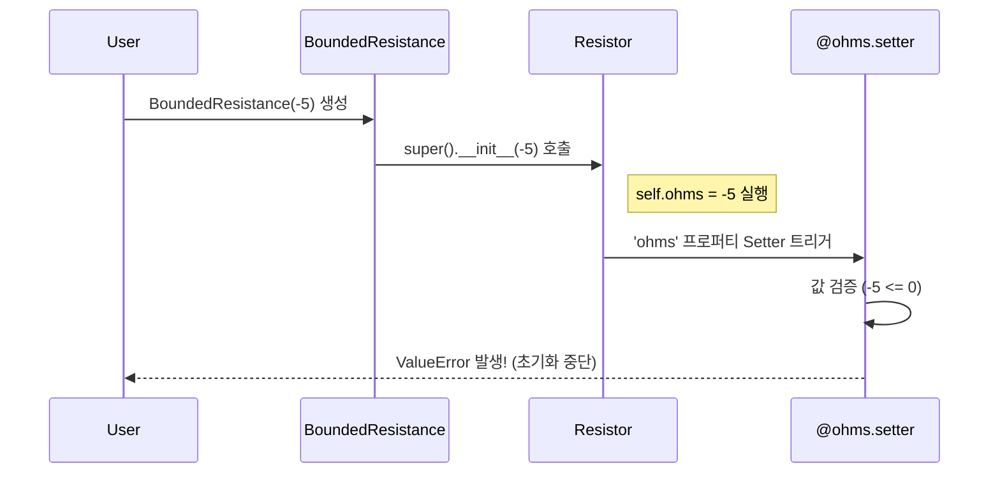

# 44 세터와 게터 메서드 대신 평범한 애트리뷰트를 사용하라 #51

## TL;DR
- **Getter**, **Setter**를 가급적 사용하지 말라
- 만약 특별한 **Getter** 동작이 필요하다면 `@property` 활용
  - 하지만 이 때 최소 놀람의 법칙(_"필요한 기능에 크나큰 깜짝 놀래킬만한 요소가 있다면 해당 기능을 다시 설계할 필요가 있을 수 있다"_)을 따라야 함
  - 느리거나 복잡한 작업을 `@property`로 구현하지 말자. 사용자는 일반적인 attribute 동작과 마찬가지로 빠르고 사용하기 쉬울 것이라고 예상할 것


## Setter & Getter
다른 언어를 사용하다가 파이썬을 접한 프로그래머들은 세터(setter)와 게터(getter)를 명시적으로 정의하지만 파이썬에서는 그럴 필요가 없음

```python
class OldResistor:
    def __init__(self, ohms):
        self._ohms = ohms

    def get_ohms(self):
        return self._ohms

    def set_ohms(self, ohms):
        self._ohms = ohms
```
파이썬에서는 따로 setter와 getter를 정의할 필요 없이 공개 attribute를 그대로 활용할 수 있음

```python
class Resistor:
    def __init__(self, ohms):
        self.ohms = ohms
        self.voltage = 0
        self.current = 0

r1 = Resistor(50e3)
r1.ohms = 10e3
r1.ohms += 5e3
```

## 데코레이터 활용
만약 attribute를 설정할 때 특별한 기능을 수행해야 한다면 `@property`[^1] 데코레이터(참조: #33)와 대응하는 setter를 사용할 수 있음.

위의 Resistor 클래스를 상속받아서, 전압 값을 세팅하면 그에 맞춰서 저항과 전류 값이 바뀌는 함수를 만들어 보자.

```python
class VoltageResistance(Resistor):
    def __init__(self, ohms):
        super().__init__(ohms)
        self._voltage = 0

    @property # getter
    def voltage(self):
        return self._voltage

    @voltage.setter # setter
    def voltage(self, voltage):
        self._voltage = voltage
        self.current = self._voltage / self.ohms


r2 = VoltageResistance(1e3) # 저항값 설정
print(f"이전: {r2.current: .2f} 암페어")
r2.voltage = 10
print(f"이후: {r2.current: .2f} 암페어")

>>>
이전: 0.00 암페어
이후: 0.01 암페어
```

이 방식을 활용해서 attribute에 어떤 값을 부여할 때 타입을 검사하거나 값을 검증하는 작업을 수행할 수도 있음 (혹은 변경할 수 없는 attribute를 만들 수도 있음)

```python
class BoundedResistance(Resistor):
    def __init__(self, ohms):
        super().__init__(ohms):
    
    @property
    def ohms(self):
        return self._ohms

    @ohms.setter
    def ohms(self, ohms):
        if ohms <= 0:
            raise ValueError(f"저항 > 0 이어야 합니다. 실제 값: {ohms}")
        self._ohms = ohms


r3 = BoundedResistance(1e3)
r3.ohms = 0

>>>
Traceback ...
ValueError: 저항 > 0 이어야 합니다. 실제 값: 0


BoundedResistance(-5)

>>>
Traceback ...
ValueError: 저항 > 0 이어야 합니다. 실제 값: -5
```


## 유의사항
`@property` 를 활용할 때는 getter와 setter 안에서 예기치 못한 동작이 일어나지 않도록 주의 필요

#### 예) getter 안에서 다른 attribute를 설정하면 안 됨
```python
class MysteriousResistor(Resistor):
    @property
    def ohms(self):
        self.voltage = self._ohms * self.current
        return self._ohms

    @ohms.setter
    def ohms(self, ohms):
        self._ohms = ohms


r7 = MysteriousResistor(10)
r7.current = 0.01
print(f"이전: {r7.voltage: .2f}")
r7.ohms
print(f"이후: {r7.voltage: .2f}")

>>>
이전: 0.00
이후: 0.10 # 저항을 호출했을 뿐인데 전압 값이 업데이트 됨
```
- `@property.setter` 안에서만 객체 상태를 변경하도록 하는 것이 바람직
-  `@property`로 정의한 메서드를 서로 관련이 없는 다른 클래스 사이에서는 공유할 수 없음 (이 때는 디스크립터(descriptor)를 활용(Better way 46))


[^1]: `property`는 파이썬 내장함수로 입력 받은 객체를 클래스의 attribute로 wrapping 해주는 역할을 함.
